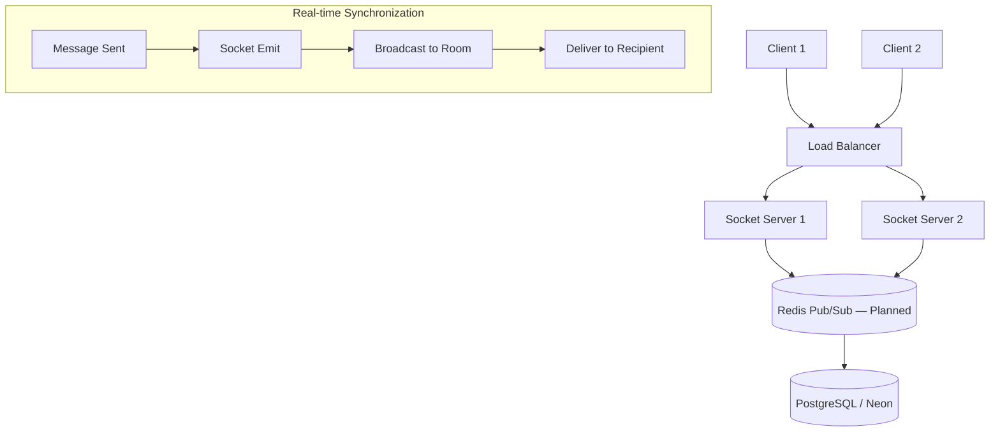
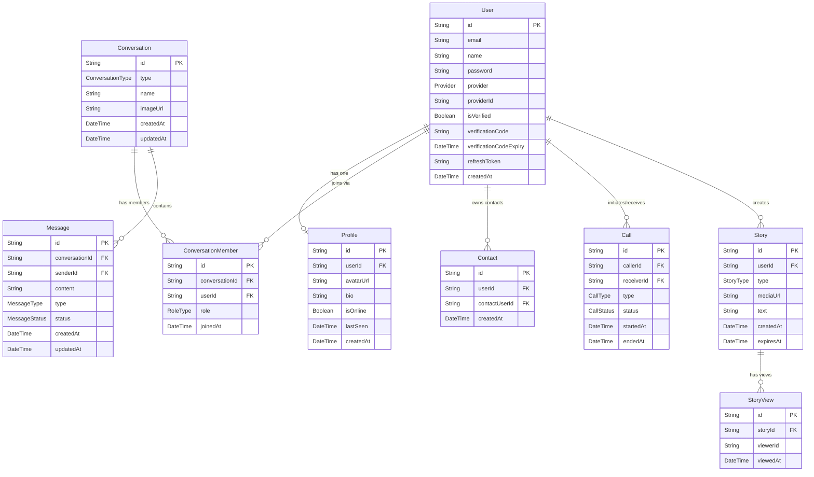
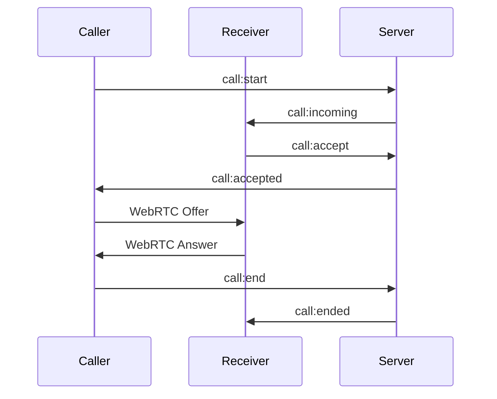

# 💬 MailTalk - Enterprise Real-Time Chat Backend

[](https://opensource.org/licenses/ISC)
[](https://nodejs.org/)
[](https://www.typescriptlang.org/)
[](https://socket.io/)
[](https://www.prisma.io/)

A scalable and modern **real-time chat backend** built with **Node.js, TypeScript, and Express**, designed with clean modular architecture and best practices in mind.

This project is currently under active development and serves as a solid foundation for building production-ready chat applications.

---

## 🎯 Executive Summary

**MailTalk** delivers a scalable foundation for modern chat applications with real-time messaging via Socket.IO, multi-provider OAuth authentication, Cloudinary-backed media handling, contact management, WebRTC-based audio/video calls, and ephemeral Stories — all built on a clean **Domain-Driven modular architecture** with Prisma ORM on top of Neon serverless PostgreSQL.

---

## 🚀 Features

### ✅ Implemented

- **Project Structure:** TypeScript with a modular DDD folder hierarchy (`domain → application → infrastructure → presentation`).
- **Core Server:** Express server with `helmet`, `compression`, CORS, `cookie-parser`, Pino structured logging, and centralized error handling.
- **Dev Experience:** `asyncWrapper` (`catchAsync`) for error-free controllers, ESLint + Prettier, `tsx --watch` dev server.
- **Config:** Environment-based configuration via `dotenv`.
- **Authentication:** Email/password register & login with JWT (access 15min + refresh 7 days), email verification with code + expiry, refresh token rotation, Google OAuth, and Facebook OAuth.
- **Profile:** Get & update profile (name, bio, avatar via Cloudinary). Auto-create profile on first fetch.
- **Chat:** Create GROUP conversations, list conversations (cursor pagination), delete conversation, send messages (TEXT / IMAGE / FILE), get messages (cursor pagination). Real-time typing indicators, message delivered/read via Socket.IO.
- **Contacts:** Add/remove contacts, list all contacts (with profile), self-add and duplicate prevention.
- **Calls:** Full WebRTC call signaling via Socket.IO (initiate, accept, reject, offer/answer/ICE candidates, end). Call history with cursor pagination.
- **Stories:** Create/delete stories (TEXT, IMAGE, VIDEO), list active stories from contacts, view a single story, add a view (dedup + no self-view), get viewers (owner only). Stories auto-expire via `expiresAt` filter.
- **Upload:** Multipart file upload to Cloudinary with exist/delete helpers. Used by Stories and Profile.

### 🛠️ In Progress / Planned

- **Auth:** Logout / token revocation endpoint.
- **Chat:** One-to-one conversation creation endpoint, add/remove group members (admin-only).
- **Profile:** Realtime online/offline presence updates (`isOnline` / `lastSeen`).
- **Contacts:** In-contact search by name (module is built; needs to be wired).
- **Calls:** Missed-call detection, `GET /call/:id`, missed calls endpoint.
- **Rate Limiting:** Redis-backed brute-force protection (login, register, global).
- **Horizontal Scaling:** Redis Pub/Sub adapter for Socket.IO.
- **DevOps:** Docker support, CI/CD pipelines, `.env.example`.
- **Tests:** Unit and integration test suite.

---

## 🏗️ System Architecture

### Event-Driven Data Flow



> **Note:** Horizontal scaling via Redis Pub/Sub is planned. The current Socket.IO setup uses single-node in-memory rooms.

---

## 🗄️ Database Architecture

MailTalk uses **PostgreSQL (Neon serverless)** managed via **Prisma ORM**.

### Entity Relationship Overview

| From | To | Type | Via / Key |
| :--- | :--- | :--- | :--- |
| `User` → `Profile` | One-to-One | `Profile.userId` (unique FK) |
| `User` → `ConversationMember` | One-to-Many | `ConversationMember.userId` |
| `Conversation` → `ConversationMember` | One-to-Many | `ConversationMember.conversationId` |
| `Conversation` → `Message` | One-to-Many | `Message.conversationId` |
| `User` ↔ `Conversation` | Many-to-Many | Through `ConversationMember` |
| `User` → `Contact` | One-to-Many | `Contact.userId` |
| `User` → `Call` (as caller) | One-to-Many | `Call.callerId` |
| `User` → `Call` (as receiver) | One-to-Many | `Call.receiverId` |
| `User` → `Story` | One-to-Many | `Story.userId` |
| `Story` → `StoryView` | One-to-Many | `StoryView.storyId` |

### Mermaid ERD



### Enums

| Enum | Values |
| :--- | :--- |
| `Provider` | `EMAIL`, `GOOGLE`, `FACEBOOK` |
| `ConversationType` | `ONE_TO_ONE`, `GROUP` |
| `RoleType` | `MEMBER`, `ADMIN` |
| `MessageType` | `TEXT`, `IMAGE`, `FILE` |
| `MessageStatus` | `SENT`, `DELIVERED`, `READ` |
| `CallType` | `AUDIO`, `VIDEO` |
| `CallStatus` | `INITIATED`, `RINGING`, `ACCEPTED`, `REJECTED`, `ENDED` |
| `StoryType` | `TEXT`, `IMAGE`, `VIDEO` |

---

## 🔐 Authentication & Security Architecture

MailTalk implements a **dual-token authentication** mechanism for high security and seamless UX.

### 🛡️ JWT Strategy

- **Access Token:** Short-lived (15 min) for securing API requests.
- **Refresh Token:** Long-lived (7 days), rotated on every refresh and stored in the database.
- **Hashing:** Passwords are never stored in plain text; we use **Bcrypt** with **12 salt rounds**.
- **Web clients:** Refresh token delivered via `HttpOnly` cookie.
- **Mobile clients:** Refresh token delivered in response body (header-based).

### 📡 Auth Endpoints

| Method | Endpoint | Description | Auth |
| :--- | :--- | :--- | :--- |
| `POST` | `/api/v1/auth/register` | User registration | Public |
| `POST` | `/api/v1/auth/verify` | Email verification with code | Public |
| `POST` | `/api/v1/auth/login` | Email/Password login | Public |
| `GET` | `/api/v1/auth/refreshToken` | Access token renewal | Public |
| `POST` | `/api/v1/auth/oauth/login` | Social login (Google / Facebook) | Public |

> ⚠️ Logout / token revocation is not yet implemented.

### 💻 Auth Middleware

```typescript
// Authorization Header: Bearer <token>
export const authMiddleware = async (req: Request, res: Response, next: NextFunction) => {
  const token = extractToken(req);
  if (!token) return res.status(401).json({ message: 'Access token required' });

  try {
    const decoded = jwt.verify(token, process.env.ACCESS_TOKEN_SECRET!);
    req.user = decoded;
    next();
  } catch (error) {
    return res.status(403).json({ message: 'Invalid or Expired token' });
  }
};
```

---

## 🌐 Multi-Provider OAuth 2.0 Integration

MailTalk supports seamless social login via Google and Facebook.

### ✅ Supported Providers

- **Google OAuth:** Token verified via Google's token info API.
- **Facebook OAuth:** Token verified via Facebook's Debug Token & Graph API.

### 🔄 OAuth Flow

1. **Client-side:** User authenticates via Google/Facebook SDK and receives an `accessToken`.
2. **Server-side:** The `accessToken` is sent to `POST /api/v1/auth/oauth/login`.
3. **Validation:** MailTalk verifies the token directly with Google/Facebook servers.
4. **Account Sync:** Existing user → login. New user → account is auto-provisioned.
5. **Session:** Server issues a standard **JWT (Access + Refresh)** to the client.

```typescript
// POST /api/v1/auth/oauth/login
{
  "provider": "google", // or "facebook"
  "accessToken": "oauth_token_from_client_sdk"
}
```

---

## 📦 Modules

### 1. 🔐 Authentication (`src/modules/auth/`)

- Register with email/password (bcrypt, 12 salt rounds).
- Email verification with code + expiry.
- Login → returns Access Token (15 min) + Refresh Token (7 days).
- Refresh token rotation.
- OAuth login (Google & Facebook).
- JWT middleware for protected routes.

### 2. 👤 Profile (`src/modules/profile/`)

- Get profile by `userId` (auto-creates if missing).
- Update profile (`name`, `bio`, `avatarUrl` via Cloudinary — replaces old image).
- `isOnline` / `lastSeen` columns exist; presence updates planned.

### 3. 💬 Chat (`src/modules/chat/`)

- Create GROUP conversation.
- List all conversations for the current user (cursor pagination).
- Delete a conversation.
- Send a message (TEXT / IMAGE / FILE) — persists + emits socket events.
- Get messages with cursor-based pagination.
- Real-time Socket.IO events:
  - `message:send` → broadcast to conversation room.
  - `typing:start` / `typing:stop`
  - `message:delivered` / `message:read`

### 4. 📇 Contact (`src/modules/contact/`)

- Add a user to contacts (blocks self-add and duplicates).
- Remove a contact.
- Get all contacts (with profile data).

#### API Endpoints

| Method | Endpoint | Description | Auth |
| :--- | :--- | :--- | :--- |
| `POST` | `/api/v1/contact/:contactId` | Add a new contact | ✅ |
| `DELETE` | `/api/v1/contact/:contactId` | Remove a contact | ✅ |
| `GET` | `/api/v1/contact` | Get all contacts | ✅ |

### 5. 📞 Call (`src/modules/call/`)

Real-time audio/video communication using a hybrid architecture:
- **Socket.IO** → signaling & real-time events.
- **WebRTC** → peer-to-peer media streaming.
- **Prisma** → call persistence & history.

#### Real-Time Events (Socket.IO)

| Event | Description |
| :--- | :--- |
| `call:start` | Initiate a call |
| `call:incoming` | Notify receiver |
| `call:accept` | Accept call |
| `call:reject` | Reject call |
| `call:end` | End call |
| `call:signal` | WebRTC signaling (offer / answer / ICE) |

#### Call Flow



#### Call Lifecycle

```
INITIATED → RINGING → ACCEPTED → ENDED
                    ↘ REJECTED
```

#### HTTP Endpoints

| Method | Endpoint | Description | Auth |
| :--- | :--- | :--- | :--- |
| `POST` | `/api/v1/call` | Get call history (cursor pagination) | ✅ |

### 6. 📖 Story (`src/modules/story/`)

Ephemeral stories visible only to contacts, similar to WhatsApp Status.

#### Features

- Create a story (TEXT, IMAGE, VIDEO via Cloudinary upload).
- Delete a story (owner only).
- Get all active stories from contacts (filtered by `expiresAt`).
- Get a single story (contact-gated).
- Add a view (dedup + blocks self-view).
- Get viewers of a story (owner only).

#### API Endpoints

| Method | Endpoint | Description | Auth |
| :--- | :--- | :--- | :--- |
| `POST` | `/api/v1/story` | Create a story | ✅ |
| `DELETE` | `/api/v1/story/:storyId` | Delete a story | ✅ |
| `GET` | `/api/v1/story` | Get active stories from contacts | ✅ |
| `GET` | `/api/v1/story/:storyId` | Get a single story | ✅ |
| `POST` | `/api/v1/viewStory/:storyId` | Add a view | ✅ |
| `GET` | `/api/v1/viewStory/:storyId` | Get viewers | ✅ |

### 7. 📤 Upload (`src/modules/upload/`)

- Multipart file upload to **Cloudinary** (images, video, documents).
- `exist` and `delete` helpers used by Story and Profile modules.
- Multer middleware handles `multipart/form-data`.

---

## 🏗️ Architecture Principles

- **Repository Pattern** — data access is fully decoupled from business logic.
- **`catchAsync` utility** — no try/catch in controllers; errors bubble to the centralized handler.
- **Zod validation** — all request bodies are validated via schemas before hitting use cases.
- **Uniform response shape:**
  ```json
  { "success": boolean, "message": "string", "data": {} }
  ```
- **JSDoc comments** on all service methods.
- **Per-module factory wiring** (`factories/`) for manual dependency injection.

---

## 📁 Project Structure

```text
src/
├── app.ts                    # Express app setup (middleware, routes, socket init)
├── server.ts                 # HTTP server entry point
├── config/                   # Environment variable loading & typed config
├── lib/
│   └── prisma.ts             # Prisma client (Neon adapter)
├── modules/
│   ├── auth/                 # Authentication & Authorization
│   │   ├── domain/           # User entity, repo interface, service interfaces
│   │   ├── application/      # register, login, verify, refresh, oauth use cases
│   │   ├── infrastructure/   # Prisma repo, bcrypt, JWT, nodemailer, OAuth providers
│   │   └── presentation/     # Controller, router, DTOs, Zod schemas
│   ├── profile/              # User profile management
│   ├── chat/                 # Conversations & messaging + Socket.IO handler
│   ├── contact/              # Contact list management
│   ├── call/                 # Audio & video calls (WebRTC signaling)
│   ├── story/                # Ephemeral stories & views
│   ├── search/               # User / conversation / message search (built, not yet wired)
│   └── upload/               # Cloudinary file uploads (multer middleware)
└── shared/
    ├── middlewares/          # authMiddleware, validate, error handler, requestLogger
    ├── router/               # Aggregated API router
    ├── socket/               # Socket.IO server init & JWT handshake
    ├── types/                # ApiResponse<T> type
    └── utils/                # AppError, catchAsync, cleanObject, extractToken, logger, sendResponse
```

> Each module follows: `domain/` · `application/` · `infrastructure/` · `presentation/` · `factories/`

---

## ⚙️ Local Setup

```bash
# 1. Clone the repository
git clone https://github.com/abdelrhman-hegazy/MailTalk.git
cd MailTalk

# 2. Install dependencies
npm install

# 3. Configure environment variables
cp .env.example .env
# Fill in your values (DATABASE_URL, JWT secrets, OAuth keys, Cloudinary, Email...)

# 4. Run Prisma migrations
npx prisma migrate deploy

# 5. Start the development server
npm run dev
```

### Required Environment Variables

| Variable | Description |
| :--- | :--- |
| `NODE_ENV` | `development` or `production` |
| `PORT` | HTTP server port |
| `DATABASE_URL` | Neon PostgreSQL connection string |
| `ACCESS_TOKEN_SECRET` | JWT access token secret |
| `REFRESH_TOKEN_SECRET` | JWT refresh token secret |
| `EMAIL_USER` | SMTP sender email |
| `EMAIL_PASSWORD` | SMTP sender password |
| `GOOGLE_CLIENT_ID` | Google OAuth client ID |
| `GOOGLE_CLIENT_SECRET` | Google OAuth client secret |
| `FACEBOOK_APP_ID` | Facebook App ID |
| `FACEBOOK_APP_SECRET` | Facebook App secret |
| `CLOUDINARY_CLOUD_NAME` | Cloudinary cloud name |
| `CLOUDINARY_API_KEY` | Cloudinary API key |
| `CLOUDINARY_API_SECRET` | Cloudinary API secret |

---

## 🔧 Tech Stack

| Technology | Version | Role |
| :--- | :--- | :--- |
| Node.js | ≥ 18 | Runtime |
| TypeScript | 5.9 | Language |
| Express | 4.x | HTTP framework |
| Socket.IO | 4.8 | Real-time events & signaling |
| Prisma | 7.x | ORM |
| PostgreSQL (Neon) | — | Database |
| Zod | 4.x | Request validation |
| JWT | 9.x | Auth tokens |
| Bcrypt | 6.x | Password hashing |
| Nodemailer | 7.x | Email delivery |
| Cloudinary | 2.x | Media storage |
| Multer | 2.x | File upload parsing |
| Pino | 10.x | Structured logging |
| Axios | 1.x | OAuth provider verification |
| Helmet | 8.x | Security headers |
