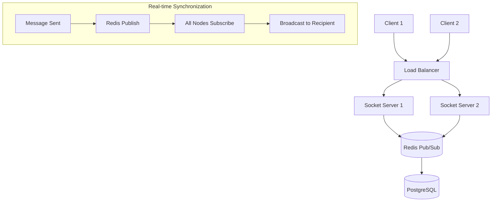
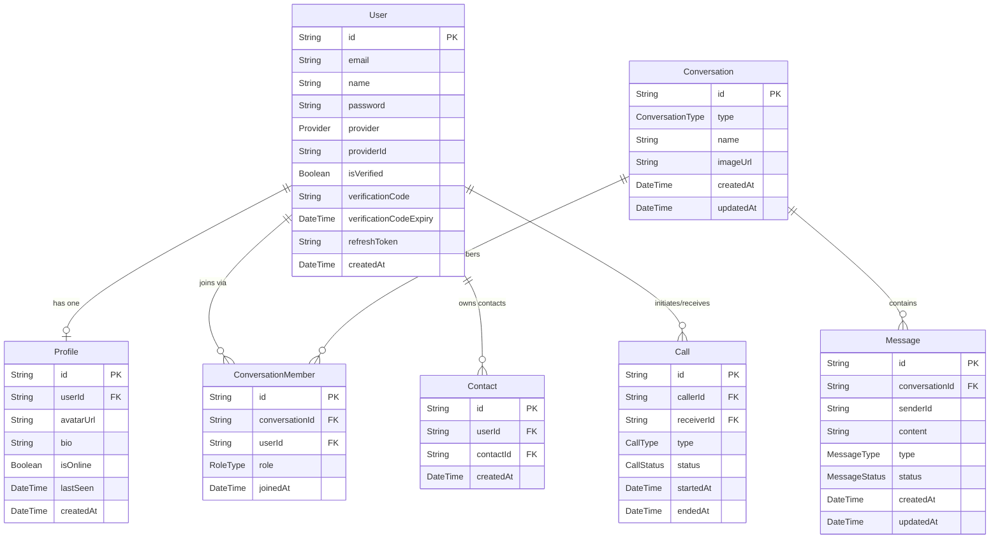
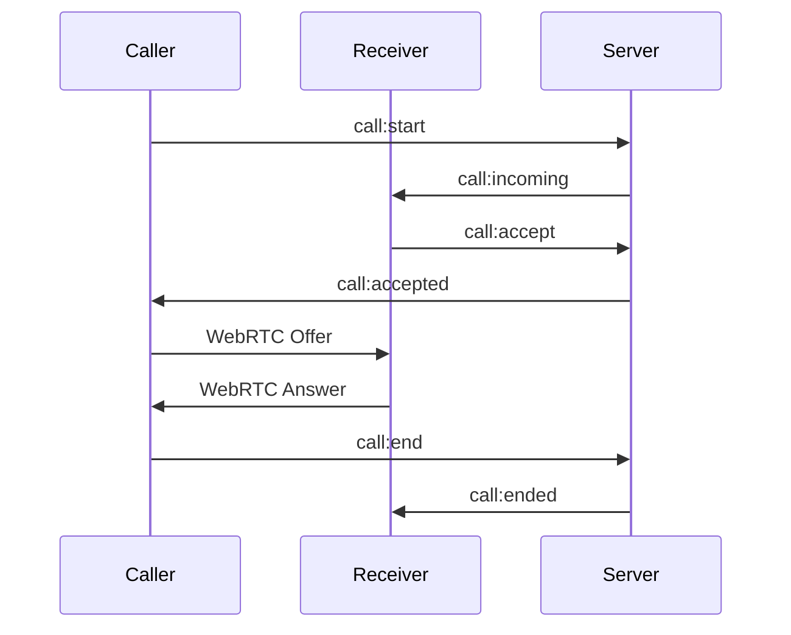

# 💬 MailTalk - Enterprise Real-Time Chat Backend

[](https://opensource.org/licenses/ISC)
[](https://nodejs.org/)
[](https://www.typescriptlang.org/)
[](https://socket.io/)

A scalable and modern **real-time chat backend** built with **Node.js, TypeScript, and Express**, designed with clean architecture and best practices in mind.

This project is currently under active development and serves as a solid foundation for building production-ready chat applications.

---

## 🎯 Executive Summary

**MailTalk** delivers a scalable foundation for modern chat applications, handling millions of concurrent connections through intelligent WebSocket management, Redis-backed pub/sub architecture, and optimized database indexing. The system supports real-time messaging, multi-provider authentication, seamless media handling, contact management, and real-time audio/video calls — all with sub-100ms latency guarantees.

---

## 🚀 Features (Current & Planned)

### ✅ Implemented
- **Project Structure:** Initialization with **TypeScript** and a scalable folder hierarchy.
- **Core Server:** Express server setup with centralized **error handling**.
- **Dev Experience:** Async error wrappers, ESLint, and Prettier integration.
- **Config:** Environment-based configuration management.
- **Infrastructure:** Basic horizontal scaling logic with **Redis**.

### 🛠️ In Progress / Planned
- **Auth:** Secure Authentication (Email / Google / Facebook) using JWT.
- **Real-time:** Full **Socket.IO** integration for messaging & typing indicators.
- **Messaging:** One-to-one & group chats with message persistence.
- **Media:** Support for images, audio, video, and documents via Cloudinary.
- **Contacts:** Personal contact list management with search capabilities.
- **Advanced:** Audio & video calls using **WebRTC**.
- **DevOps:** Docker support, CI/CD pipelines, and Pino logging.

---

## 🏗️ System Architecture

### Event-Driven Data Flow



---

## 🗄️ Database Architecture

MailTalk uses **PostgreSQL** managed via **Prisma ORM**. Below is an overview of all models, their fields, and relationships derived directly from the schema.

### Entity Relationship Overview

| From | To | Type | Via / Key |
| :--- | :--- | :--- | :--- |
| `User` → `Profile` | One-to-One | `Profile.userId` (unique FK) |
| `User` → `ConversationMember` | One-to-Many | `ConversationMember.userId` |
| `Conversation` → `ConversationMember` | One-to-Many | `ConversationMember.conversationId` |
| `Conversation` → `Message` | One-to-Many | `Message.conversationId` |
| `User` ↔ `Conversation` | **Many-to-Many** | Through `ConversationMember` join model |
| `User` → `Contact` | One-to-Many | `Contact.userId` |
| `User` → `Call` (as caller) | One-to-Many | `Call.callerId` |
| `User` → `Call` (as receiver) | One-to-Many | `Call.receiverId` |

### Mermaid ERD



### Enums

| Enum | Values |
| :--- | :--- |
| `Provider` | `EMAIL`, `GOOGLE`, `FACEBOOK` |
| `ConversationType` | `ONE_TO_ONE`, `GROUP` |
| `RoleType` | `MEMBER`, `ADMIN` |
| `MessageType` | `TEXT`, `IMAGE`, `FILE` |
| `MessageStatus` | `SENT`, `DELIVERED`, `READ` |
| `CallType` | `AUDIO`, `VIDEO` |
| `CallStatus` | `INITIATED`, `ACCEPTED`, `ENDED`, `MISSED` |

> **Note:** `ConversationMember` acts as the join table for the `User` ↔ `Conversation` many-to-many relationship, and also carries role metadata (`MEMBER` / `ADMIN`) and a `joinedAt` timestamp.

---

## 🔐 Authentication & Security Architecture

MailTalk implements a **robust dual-token authentication** mechanism designed for high security and seamless user experience.

### 🛡️ JWT Strategy
* **Access Token:** Short-lived (15 min) for securing API requests.
* **Refresh Token:** Long-lived (7 days) stored securely to rotate access tokens.
* **Hashing:** Passwords are never stored in plain text; we use **Bcrypt** with **12 salt rounds**.

### 📡 Auth Endpoints

| Method | Endpoint | Description | Security |
| :--- | :--- | :--- | :--- |
| `POST` | `/api/v1/auth/register` | User registration | Public + Rate Limited |
| `POST` | `/api/v1/auth/login` | Email/Password login | Public + Rate Limited |
| `POST` | `/api/v1/auth/refresh` | Access token renewal | Public |
| `POST` | `/api/v1/auth/logout` | Token revocation | Protected |

### 🚦 Rate Limiting & Protection

To prevent **Brute-Force** attacks, we've implemented Redis-backed rate limiting:
* **Login:** Maximum 5 attempts per 15 minutes per IP.
* **Registration:** Maximum 3 accounts per hour per IP.
* **Global:** 1000 requests per 15 minutes per user.

### 💻 Implementation Snippet (Middleware)

```typescript
// Authorization Header: Bearer <token>
export const authenticateToken = async (req: Request, res: Response, next: NextFunction) => {
  const authHeader = req.headers['authorization'];
  const token = authHeader?.split(' ')[1];

  if (!token) return res.status(401).json({ message: 'Access token required' });

  try {
    const decoded = jwt.verify(token, process.env.JWT_SECRET!);
    req.user = decoded;
    next();
  } catch (error) {
    return res.status(403).json({ message: 'Invalid or Expired token' });
  }
};
```

---

## 🌐 Multi-Provider OAuth 2.0 Integration

MailTalk supports seamless social login, allowing users to authenticate securely using their existing accounts.

### ✅ Supported Providers
- **Google OAuth:** Verified via Google's token info API.
- **Facebook OAuth:** Verified via Facebook Debug Token and Graph API.

### 🔄 OAuth Flow Architecture
1. **Client-side:** User authenticates via Google/Facebook SDK and receives an `accessToken`.
2. **Server-side:** The `accessToken` is sent to `/api/v1/auth/oauth-login`.
3. **Validation:** MailTalk verifies the token directly with Google/Facebook servers.
4. **Account Sync:** If the user exists, we log them in; otherwise, a new account is provisioned.
5. **Session:** Server issues a standard **JWT (Access + Refresh)** to the client.

### 📡 OAuth API Usage

```typescript
// POST /api/v1/auth/oauth-login
{
  "provider": "google", // or "facebook"
  "accessToken": "oauth_token_from_client_sdk"
}
```

---

## 📦 Modules

### 1. 🔐 Authentication Module (`src/modules/auth/`)
- Register with email/password (bcrypt, 12 salt rounds)
- Login with email/password → return Access Token (15min) + Refresh Token (7 days)
- OAuth login (Google & Facebook) via external token verification
- Refresh token rotation endpoint
- Logout (revoke refresh token)
- Email verification with code + expiry
- Redis-backed rate limiting (5 login attempts / 15min per IP)
- JWT middleware for protected routes

### 2. 👤 Profile Module (`src/modules/profile/`)
- Get my profile (authenticated)
- Update profile (avatarUrl, bio)
- Get any user's profile by userId
- Update online status & lastSeen automatically

### 3. 💬 Chat Module (`src/modules/chat/`)
- Create ONE_TO_ONE or GROUP conversation
- Get all conversations for the current user
- Get a single conversation by ID
- Add/remove members (admin only for groups)
- Send a message (TEXT / IMAGE / FILE)
- Get messages with pagination (cursor-based)
- Real-time events via Socket.IO:
  - `message:send` → broadcast to conversation members
  - `typing:start` / `typing:stop`
  - `user:online` / `user:offline`
  - Mark messages as DELIVERED / READ

### 4. 📇 Contact Module (`src/modules/contact/`)

#### 🎯 Overview
The Contact module enables users to manage their personal contact list, similar to modern messaging apps like WhatsApp. It allows quick access to frequent users and improves chat experience.

#### ⚙️ Features
- Add a user to contacts
- Remove a contact
- Get all contacts for the current user
- Search within contacts (by name)
- Prevent duplicate contacts

#### 📡 API Endpoints

| Method | Endpoint | Description | Auth |
| :--- | :--- | :--- | :--- |
| `POST` | `/api/v1/contacts` | Add a new contact | ✅ |
| `DELETE` | `/api/v1/contacts/:contactId` | Remove a contact | ✅ |
| `GET` | `/api/v1/contacts` | Get all contacts | ✅ |
| `GET` | `/api/v1/contacts/search?q=` | Search contacts | ✅ |

#### 🧠 Data Model
```
User (owner) → Contact → User (target)
├── userId    : owner of the contact list
└── contactId : the added user
```

#### 🔒 Business Rules
- A user cannot add themselves
- Prevent duplicate contacts using a unique constraint
- Optional: auto-create reverse contact

#### 🚀 Use Cases
- `AddContactUseCase`
- `RemoveContactUseCase`
- `GetContactsUseCase`
- `SearchContactsUseCase`

---

### 5. 📞 Call Module (`src/modules/call/`)

#### 🎯 Overview
The Call module enables real-time audio and video communication using a hybrid architecture:
- **Socket.IO** → signaling & real-time events
- **WebRTC** → peer-to-peer media streaming
- **PostgreSQL (Prisma)** → call persistence & history

#### ⚙️ Features
- Start audio/video call
- Accept / Reject call
- End call
- Missed call detection
- Call history (with pagination)
- Call status tracking

#### 📡 Real-Time Events (Socket.IO)

| Event | Description |
| :--- | :--- |
| `call:start` | Initiate a call |
| `call:incoming` | Notify receiver |
| `call:accept` | Accept call |
| `call:reject` | Reject call |
| `call:end` | End call |
| `call:signal` | WebRTC signaling (offer/answer/ICE) |

#### 🔄 Call Flow



#### 🗄️ Call Lifecycle

```
INITIATED → ACCEPTED → ENDED
         ↘ MISSED
```

#### 📡 HTTP Endpoints

| Method | Endpoint | Description | Auth |
| :--- | :--- | :--- | :--- |
| `GET` | `/api/v1/calls` | Get call history | ✅ |
| `GET` | `/api/v1/calls/:id` | Get call details | ✅ |
| `GET` | `/api/v1/calls/missed` | Get missed calls | ✅ |

#### 🧠 Data Model

```
Call
 ├── callerId
 ├── receiverId
 ├── type     (AUDIO / VIDEO)
 ├── status   (INITIATED / ACCEPTED / ENDED / MISSED)
 ├── startedAt
 └── endedAt
```

#### 🧩 Architecture
- **Socket Layer** → Real-time signaling
- **UseCase Layer** → Business logic
- **Repository Layer** → Prisma (DB)

#### 🚀 Use Cases
- `InitiateCallUseCase`
- `AcceptCallUseCase`
- `RejectCallUseCase`
- `EndCallUseCase`
- `GetUserCallsUseCase`

---

## 🏗️ Architecture Requirements
- Use **Repository Pattern** (separate data access from business logic)
- Use **asyncWrapper** utility for error handling (no try/catch in controllers)
- All responses follow this shape:
  ```json
  { "success": boolean, "message": string, "data": {} }
  ```
- Use **Zod** for request validation
- Add **JSDoc** comments on all service methods

---

## 📁 Project Structure

```text
src/
├── config/         # App configuration & Environment variables
├── controllers/    # API request handlers
├── middlewares/    # Auth, Validation, & Global Error handlers
├── models/         # Database schemas & Data models
├── modules/
│   ├── auth/       # Authentication & Authorization
│   ├── profile/    # User profile management
│   ├── chat/       # Conversations & messaging
│   ├── contact/    # Contact list management
│   └── call/       # Audio & video calls (WebRTC)
├── routes/         # REST API route definitions
├── services/       # Core business logic
├── sockets/        # WebSocket event listeners & emitters
└── utils/          # Shared utility functions (Logger, Wrappers)
```

---

## ⚙️ Local Setup

```bash
# 1. Clone the repository
git clone https://github.com/abdelrhman-hegazy/MailTalk.git
cd MailTalk

# 2. Install dependencies
npm install

# 3. Configure environment variables
cp .env.example .env
# Open .env and fill in your values (DB, Redis, JWT secrets, OAuth keys...)

# 4. Start the development server
npm run dev
```
